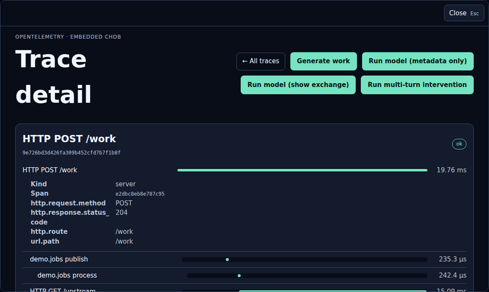
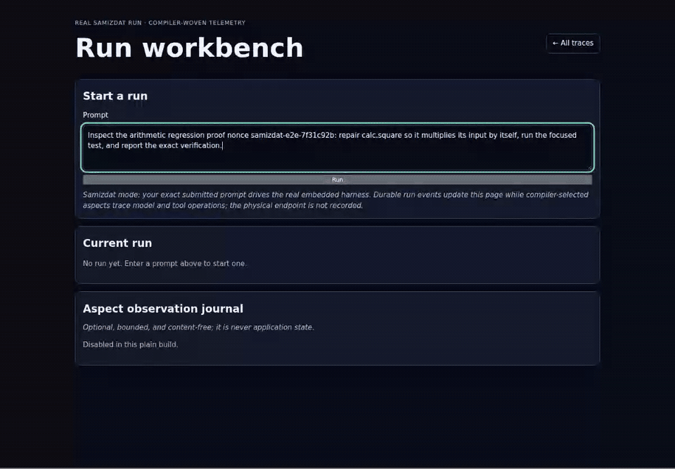
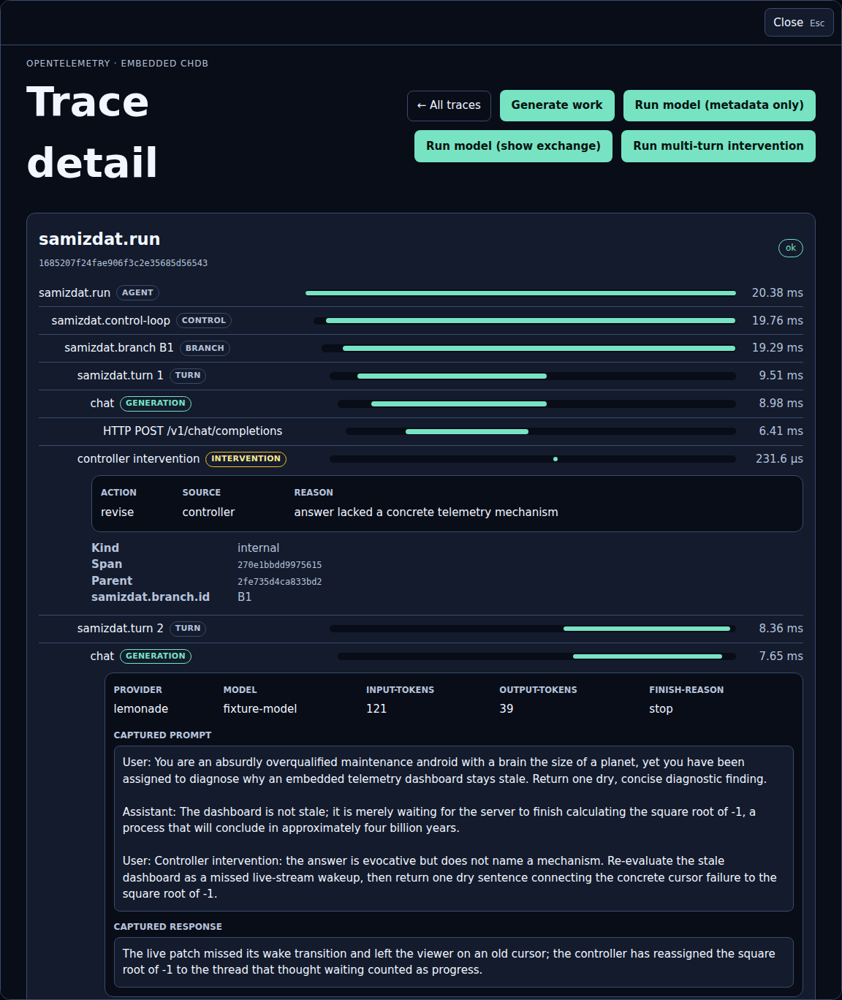

# Jolt observability demo

A self-contained Ring application that receives and generates OpenTelemetry
traces, logs, and metrics, stores them in embedded chDB, and serves a lightweight
trace workbench. The initial page and trace details are server-rendered; the SSE
enhancement streams durable updates without instrumenting the viewer's own
requests.

## Run it

Install [Jolt](https://github.com/jolt-lang/jolt), then install the native chDB
library pinned by this project:

```sh
jolt -M:setup-native
jolt -m demo.main
```

Open <http://127.0.0.1:8080/> and select **Generate work**. The resulting trace
contains five parent-linked spans across a propagated producer/consumer queue
handoff and a real loopback HTTP client/server boundary, with correlated logs.
Source mode marks its three explicit HTTP fallback spans as
`demo.instrumentation.mode=source-fallback`. The compiler-woven build replaces
those fallbacks with separately published generic HTTP providers and adds a
sixth DB span around the unchanged embedded query through the library-owned
`jolt-lang/db` manifest. Traces and logs appear in the open page through a
bounded SSE stream; the page remains usable without JavaScript.



For the Samizdat-shaped model trace, point the demo at an OpenAI-compatible
Lemonade server and use either model action in the header:

```sh
DEMO_LEMONADE_BASE_URL=http://model-host.example:8000/v1 \
DEMO_LEMONADE_MODEL=local-model \
DEMO_LEMONADE_DISABLE_THINKING=true \
JOLT_CHDB_LIB=/path/to/libchdb.so jolt -m demo.main
```

**Run model (metadata only)** records the run/branch/turn/generation/HTTP/tool
hierarchy and usage without content. **Run model (show exchange)** explicitly
records the bounded prompt and assistant response after stripping common
delimited thinking output. **Run multi-turn intervention** records the first
answer, a controller revision, and a second model turn in one parent-linked
trace. Credentials and tool arguments are never recorded by default; thinking
is disabled by default. In explicit capture mode, the same bounded redaction
policy also records the arguments and returned envelope for each tool call, and
the trace viewer presents them as a Samizdat-supplied Kindly card.

Samizdat presentation policy lives beside its instrumentation vocabulary in
`demo.samizdat-kindly`. It annotates values with Kindly's standard
[`:kindly/kind` and `:kindly/options` value metadata](https://scicloj.github.io/kindly-noted/kindly/);
the reusable viewer
only understands generic Kindly values plus a small namespaced set of layout
hints. Raw stored telemetry and JSON APIs remain presentation-free.

Configuration is optional:

- `DEMO_PORT` selects the listening port (default `8080`).
- `DEMO_CHDB_SPEC` selects the chDB database (default `chdb::memory:`).
- `DEMO_OSCOPE_PATH` mounts the embeddable explorer and its derived refresh,
  enhancement-asset, and export routes (default `/oscope`).
- `JOLT_CHDB_LIB` selects an existing `libchdb` installation.
- `JOLT_CHDB_CACHE_DIR` selects where the installer stores chDB.
- `DEMO_LEMONADE_BASE_URL` selects the physical OpenAI-compatible endpoint,
  which is never copied into telemetry.
- `DEMO_LEMONADE_TELEMETRY_ADDRESS` selects a non-identifying display label
  (default `local-model-host`).
- `DEMO_LEMONADE_DISABLE_THINKING` defaults to true; set it to `false` only when
  intentionally testing provider thinking behavior.





For persistent data, prefer a map dbspec from an embedding application. The
standalone demo also accepts a `chdb:` URI through `DEMO_CHDB_SPEC`; the demo
does not delete persistent data.

## Run the embedded Samizdat workbench

The standalone composition under `samizdat-demo/` runs the real embedded
Samizdat control loop in the same process as the collector and viewer. It does
not start Samizdat's HTTP server. The standalone build requires the
aspect-enabled Jolt compiler from the user's fork. Samizdat and the reusable
observability libraries are pinned to exact published fork SHAs; the only
`:local/root` is the enclosing demo application being compiled from
`samizdat-demo/`.

Build it, then launch it through the cwd-safe wrapper:

```sh
cd samizdat-demo
env JOLT_BUILD_PROFILE=1 \
  /absolute/path/to/jolt-with-chez-10.4.1 \
  /absolute/path/to/aspect-enabled-jolt build \
  -m demo.samizdat-main -o ../target/samizdat-observability-demo
cd ..

env DEMO_SAMIZDAT_ROOT=/absolute/path/to/a/disposable/project \
DEMO_SAMIZDAT_DB=/absolute/path/to/samizdat.sqlite3 \
DEMO_CHDB_SPEC='chdb:/absolute/path/to/telemetry' \
JOLT_CHDB_LIB=/absolute/path/to/libchdb.so \
HARNESS_PROVIDER=local \
HARNESS_BASE_URL=http://127.0.0.1:PORT/v1 \
HARNESS_MODEL=local-model \
  scripts/run-samizdat-demo.sh
```

The release build performs whole-program inference over the complete Samizdat
closure and can take several minutes. `JOLT_BUILD_PROFILE=1` prints each build
phase so active compilation is not mistaken for a hang; allow roughly twelve
minutes for a cold gate on a constrained WSL instance.

Open <http://127.0.0.1:8080/workbench>. The exact submitted prompt drives
Samizdat. Durable run events stream into the page while compiler-selected
independent consumers create both the bounded event journal and parent-linked
run, turn, model, tool, and outbound HTTP client spans. The compiler composes
the journal outside the OTel consumer at each semantic join point; neither
consumer depends on the other. The HTTP advice injects its own W3C
`traceparent` into the maintained `jolt.http-client` call through the compiler's
explicit `:replace-args-v1` contract, without modifying that library. Launching
from the target project is required for Samizdat's relative `eval` and file semantics;
`scripts/run-samizdat-demo.sh` enforces that invariant.

Model and tool content are absent from telemetry by default. Set
`DEMO_CAPTURE_CONTENT=1` only for a deliberate local demo; captured
prompt/response text and tool argument/result summaries remain bounded by
`DEMO_CAPTURE_MAX_CHARS` and can be filtered with comma-separated
`DEMO_REDACT_TERMS`. Physical endpoints and API keys are never captured by
this provider. `DEMO_CAPTURE_MODEL_CONTENT=1` remains a compatibility alias.

The deterministic compiled-binary proof runs a real coding loop that creates
and claims a task, reads source and tests, edits the source, runs the
regression, and verifies woven model/tool telemetry. Its nonce-bearing prompt
must reach the model fixture verbatim, and every fixture request must carry a
valid `traceparent` whose trace/span identity matches the stored HTTP client
span:

```sh
JOLT_CHDB_LIB=/absolute/path/to/libchdb.so \
  test/samizdat_playwright_e2e.sh
```

`test/samizdat_real_run_smoke.sh` provides the corresponding browser-free
compiled-binary smoke.

The same deterministic real run produces the checked-in animated trace tour.
It submits the nonce-bearing coding task, waits for the actual edit and test
loop, navigates to the resulting trace, and opens the captured model exchange:

```sh
JOLT_CHDB_LIB=/absolute/path/to/libchdb.so npm run docs:samizdat-gif
```

This recorder opts into bounded model-content capture only for its local
fixture and requires Chromium plus `ffmpeg`. It never records the physical
model endpoint.

## Run the offline workbench fixture

`GET /workbench` is a separate, self-contained page: enter a prompt and watch
one run evolve through ordered semantic-stage events — `run-opened`,
`turn-started`, `model-requested`, `tool-dispatched`, `tool-completed`,
`controller-decided`, `run-closed` — down to a terminal response and capture
state. State lives in a `glimmer.ratom` cell; `jolt.datastar.core` streams
live updates over SSE scoped to that one route.

The default `demo.main` entrypoint still uses an intentionally offline fixture.
`demo.workbench-fixture`
is a deterministic, offline, hand-scripted stand-in shaped like a Samizdat
control-loop run — it never opens a socket, reads an environment variable, or
names a physical host. It tells the same coding-agent SSE reconnect story as
`test/browser/model-fixture-server.js`: an initially plausible cursor reset is
rejected because it replays rows, then revised into a race-safe,
`Last-Event-ID`-aware patch with a deterministic regression test.
`demo.workbench-fixture/AsyncRunAdapter` is also implemented by
`demo.samizdat-adapter`, so the same route, state machine, live stream, and
rendering layer serve either the fixture or the real embedded harness.

`/workbench` GET, POST, and SSE traffic is excluded from application
instrumentation the same way `/`, `/traces/*`, and the agent-demo routes are,
so viewing or driving the workbench cannot feed telemetry back into itself.

The page also demonstrates a second, non-OTel aspect consumer. A plain Jolt
build shows the bounded observation journal as disabled. With the experimental
compiler-aspect build, the library-owned workbench manifest selects the
semantic `:agent/run` join point and `demo.aspect-provider` records enter/return
ordering without retaining prompts, responses, exception messages, or host
names. The journal is display-only and is never consulted by the run state
machine.

## Plotje, Hiccup, and the oscope slice

Open `/oscope/telemetry` for the extracted oscope trace workbench: bounded
service/operation/status/duration/time filtering, complete parent/child span
trees, span events, correlated logs, and live static-first refresh. The demo
supplies only its Samizdat Kindly adviser at the rendering boundary; oscope
itself contains no agent-specific vocabulary.

Open `/oscope/edit/plotje` for the bounded Plotje/grammar-of-graphics editor and
`/oscope/edit/hiccup` for the safe Hiccup widget editor. Both are supplied by
the same mountable oscope visualization-document boundary, server-rendered
forms first; a small same-origin script progressively replaces only the preview
and is covered by CSP/no-JavaScript browser tests. The portable Plotje backend
renders line, point, categorical bar, area, rule, and tick marks to SVG on Jolt,
including bounded palettes, colors, opacity, stroke/point/bar sizing, grids,
and categorical axis labels. The editor includes an in-page grammar reference
and loadable layered examples, so it does not assume prior Plotje expertise.
The JVM adapter checks the compatible core spec against upstream Plotje as an
oracle.

The exact published `chucklehead-dev/oscope` revision owns the explorer's live
source, query/view model, Ring adapter, and bounded raw downloads. A closed
telemetry distribution query becomes one serializable EDN screen containing
controls, an accessible table, a validated Plotje spec, and the exact SQL-free
query plan that produced it. `/oscope/export` downloads allowlisted physical
span, log, or metric rows as Arrow or Parquet within explicit 24-hour,
100,000-row, and 64-MiB result caps. One export remains admitted until its HTTP
body drains. The static page remains fully functional without JavaScript; an
opt-in Live mode refreshes the complete Plotje/table/provenance screen in place,
and Freeze copies that exact half-open window into the export form. The viewer,
refresh, asset, and export routes are all excluded from demo instrumentation.
The native adapters consume the same screen without a second UI schema. See
[docs/oscope-vertical-slice.md](docs/oscope-vertical-slice.md) and
[docs/plotje-portability.md](docs/plotje-portability.md).

```sh
JOLT_TOOLCHAIN=/absolute/path/to/jolt-with-chez-10.4.1 \
JOLT_ASPECT_BIN=/absolute/path/to/aspect-enabled-jolt \
  test/aspect_build_smoke.sh
```

Build the complete woven server and run the same Playwright live-update,
workbench, and no-JavaScript story against that standalone executable with:

```sh
JOLT_TOOLCHAIN=/absolute/path/to/jolt-with-chez-10.4.1 \
JOLT_ASPECT_BIN=/absolute/path/to/aspect-enabled-jolt \
JOLT_CHDB_LIB=/path/to/libchdb.so \
  npm run test:browser:aspect
```

That gate proves the plain source story has five spans, the woven story has six,
the generated `SELECT` span is a direct child of the request span, generic HTTP
spans contain no fallback provenance, and exporter, schema, explorer, API,
viewer, and deferred SSE work cannot feed back through auto-instrumentation.
The server provider ends its span at accepted Ring callback completion and then
flushes it before redirect-driven viewer queries, preventing partial trace
roots in both JavaScript and no-JavaScript flows.

## Receive OTLP

The server accepts OTLP/HTTP JSON on:

- `POST /v1/traces`
- `POST /v1/logs`
- `POST /v1/metrics`

Requests are bounded and deliberately excluded from application
instrumentation, preventing receiver/viewer feedback loops. See [SPEC.md](SPEC.md)
for the route, lifecycle, query, and safety contracts.

## Test

Install the pinned native test engine, then run the deterministic, integration,
and shrinking property suites:

```sh
jolt -M:setup-native
jolt -A:test -m hegel.install
jolt -M:test
```

The browser story requires Node 18+ and the pinned Chromium bundle:

```sh
npm install
npx playwright install chromium
JOLT_CHDB_LIB=/path/to/libchdb.so npm run test:browser
```

Use a fresh filesystem-backed chDB for the same live-update story with:

```sh
JOLT_CHDB_LIB=/path/to/libchdb.so npm run test:browser:persistent
```

The same deterministic story owns the checked-in documentation frames:

```sh
JOLT_CHDB_LIB=/path/to/libchdb.so npm run docs:screenshots
```

The JVM Plotje oracle verifies that the demo's normalized chart spec is
accepted by the exact upstream Plotje revision:

```sh
clojure -M:plotje-oracle-test
```

See [docs/storyboard.md](docs/storyboard.md) for the tested interaction and
[docs/instrumented-build-spike.md](docs/instrumented-build-spike.md) for the
implemented provider-neutral aspect/weaver contract and remaining propagation
and lifecycle fast follows. The resolved Samizdat run,
control-loop, model, tool, memory, HTTP, and DB seams are recorded in
[docs/samizdat-instrumentation.md](docs/samizdat-instrumentation.md).
The cross-repository release order and exact remaining SHA replacements are in
[docs/publication-checklist.md](docs/publication-checklist.md); it opens no
upstream pull request.

Workspace development commands that can invoke Chez must use the repository's
Chez 10.4.1 wrapper, as documented by the workspace `AGENTS.md`.

## License

Copyright 2026 contributors. Distributed under the Eclipse Public License 2.0;
see [LICENSE](LICENSE).
