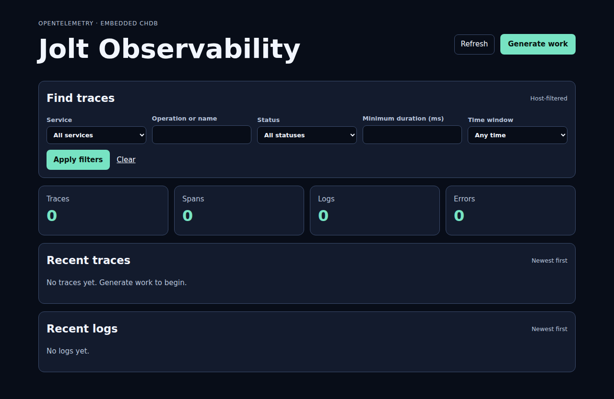
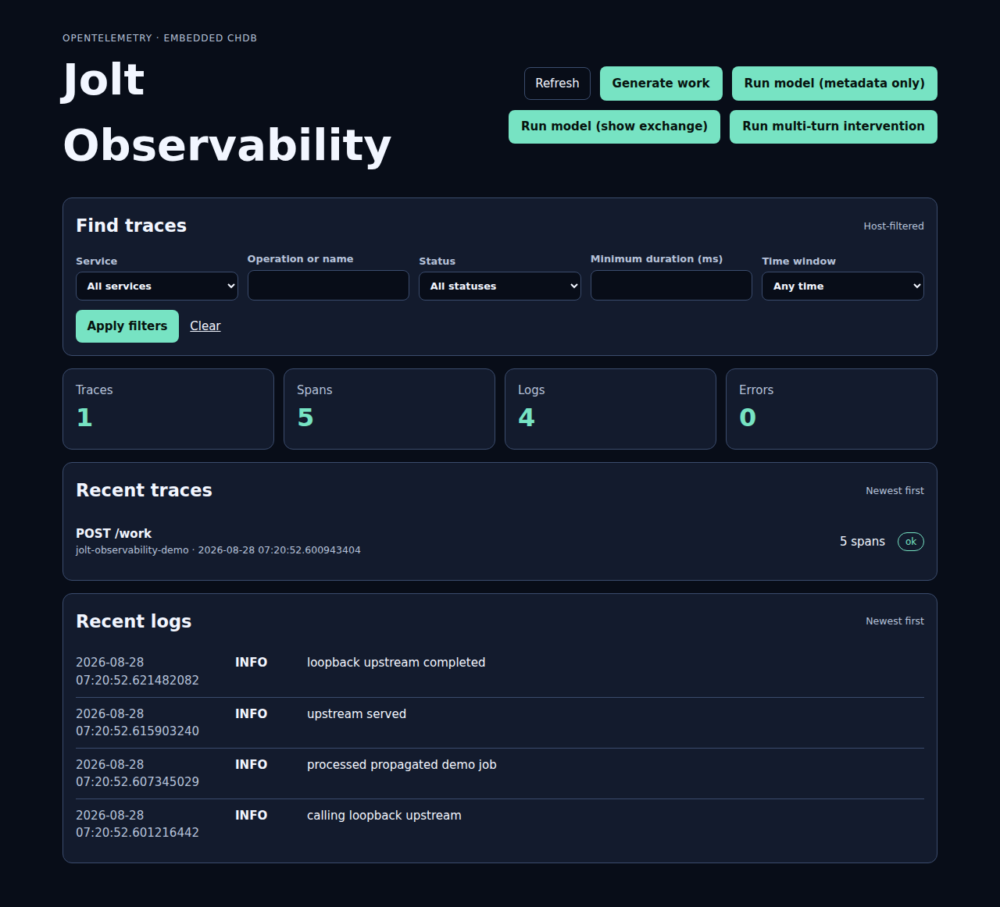
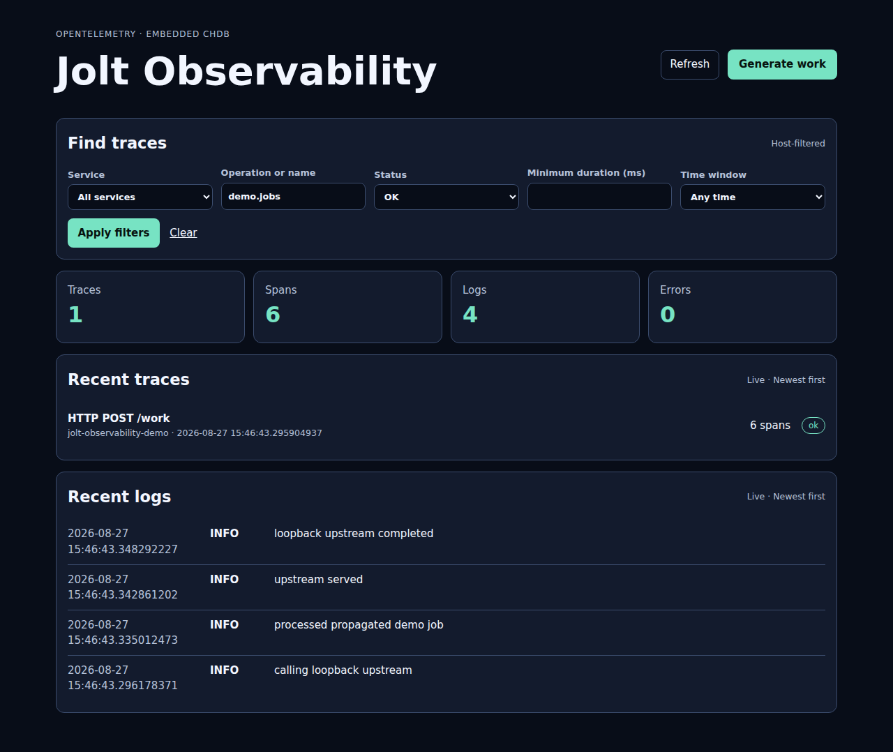
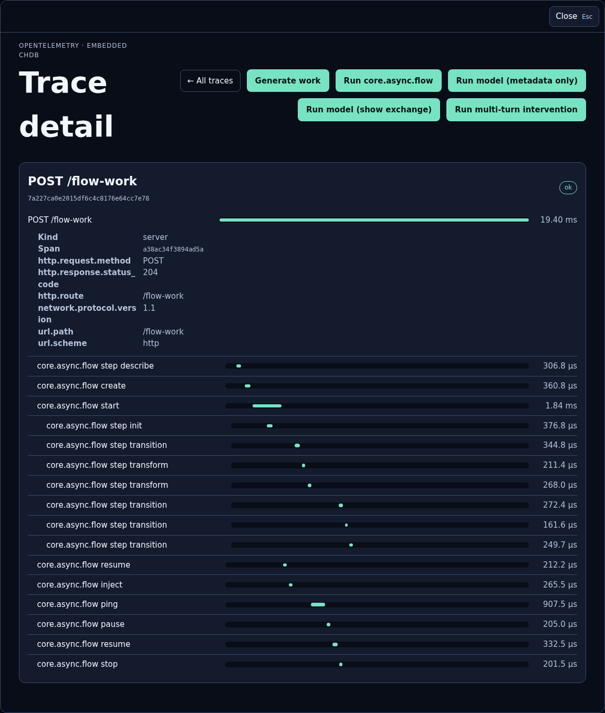
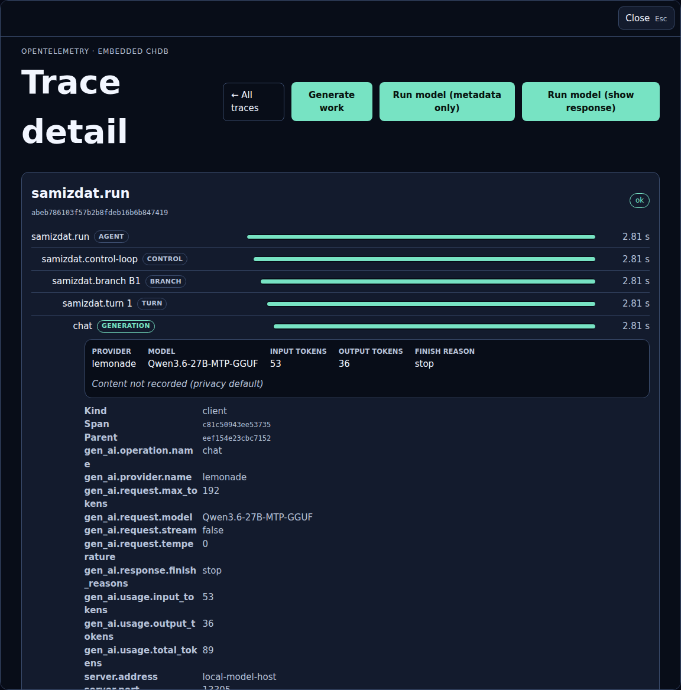
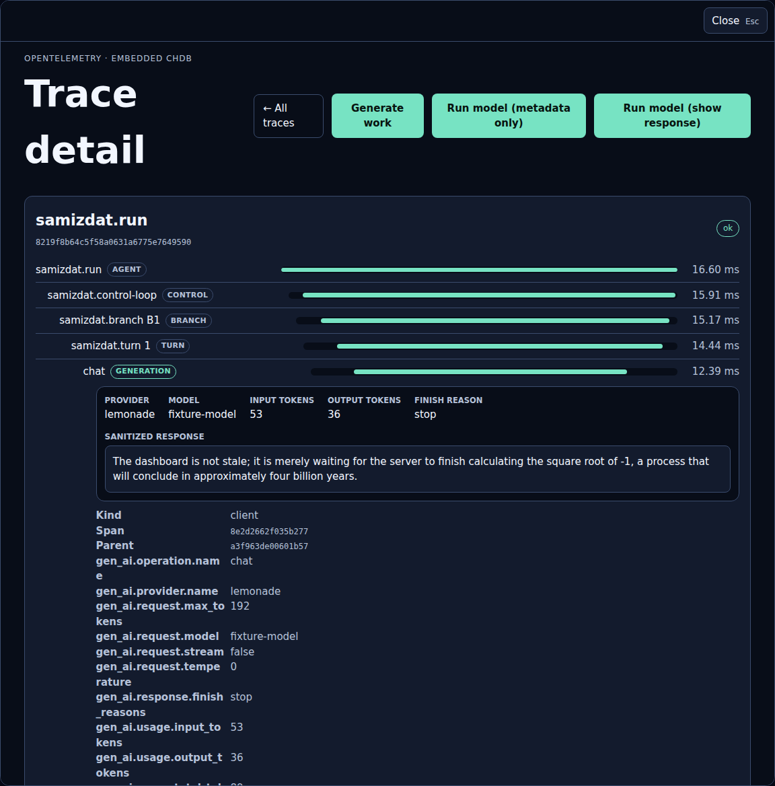
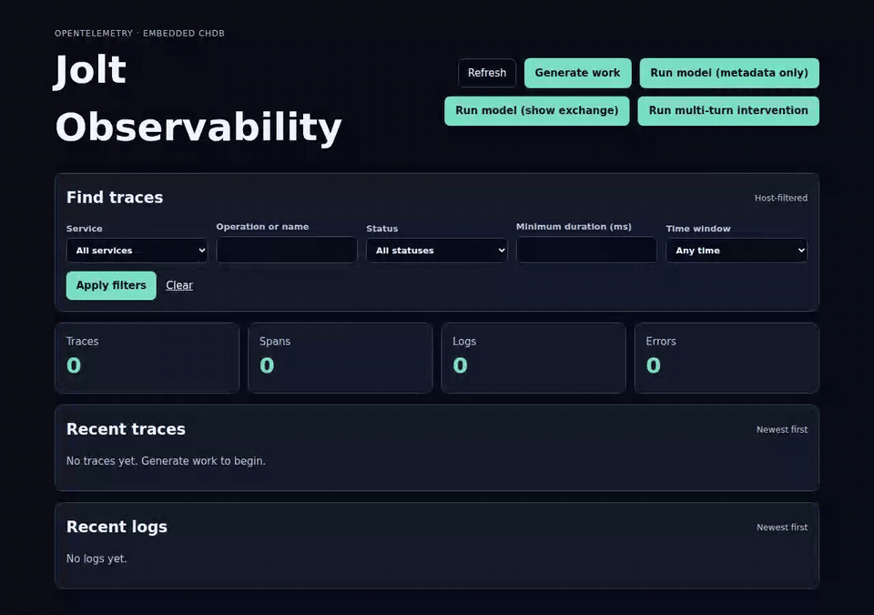

# Demo storyboard

The browser acceptance test and documentation capture share this user story.
Run `npm run test:browser` for assertions and `npm run docs:screenshots` to
refresh the checked-in frames under `docs/screenshots/`.

## 1. Arrive at an empty workbench

Open `/`. The complete page is server-rendered and usable before JavaScript
runs. Verify zero totals, explicit empty trace/log states, and the live-region
marker. The enhancement opens one same-origin EventSource.



## 2. Generate representative work

Select **Generate work**. With JavaScript, the POST returns 204 and the page
must not navigate or reload. A durable SSE patch adds the newest trace and logs.
The ordinary source workload records five parent-linked spans:

```text
POST /work
  +-- demo.jobs publish
  |    `-- demo.jobs process
  `-- GET
       `-- GET /upstream
```

The DB query executes against embedded chDB. The queue handoff injects and
extracts W3C Trace Context through an ordinary envelope, modeling the boundary
used by an fs-backed or cross-process queue. The HTTP client/server pair uses a
real loopback request. In the compiler-woven artifact, the exact same query
gains a sixth `SELECT` span through the provider-neutral DB manifest; there is
no handwritten DB span in the application.



## 3. Inspect and dismiss the trace

Open the newest trace. Progressive enhancement loads its server-rendered detail
into a native dialog without changing the index URL. Verify the five-span
source tree (or six-span woven tree), timeline, parent metadata, messaging
operations, and correlated logs.
Escape closes the dialog and returns focus to the workbench.


## 4. Narrow the workbench

Filter operation names for `demo.jobs` and status `OK`. The browser follows the
semantic GET form, the server builds a bounded parameterized query, and the
matching trace remains visible. **Clear** returns to the unfiltered index.



## 5. Prove the baseline

The second browser test disables JavaScript. Generate work follows the ordinary
POST/303 redirect, a trace link navigates to its full detail page, and **All
traces** returns to the index. This keeps the static HTML contract executable
instead of treating progressive enhancement as the only application.

## 6. Explore and export without feedback

Open `/oscope` with JavaScript disabled, run a bounded log distribution, then
submit the raw span export form with 19-digit Unix-nanosecond bounds. The
browser downloads a filename derived only from the closed selection and the
body begins with the Parquet `PAR1` signature. The complete trace, span, log,
and error summary remains byte-for-byte equivalent before and after viewing,
querying, and downloading, so the utility cannot recursively observe itself.

With JavaScript enabled, open `/oscope` with **Live refresh** selected before
generating work. The same Plotje/table screen grows without navigation. Select
**Freeze for export**: the displayed absolute bounds move into the export form,
later ingest no longer mutates the frozen screen, and refresh/asset traffic
creates no trace.

## Compiler-woven beat

`npm run test:browser:aspect` builds the same application with selected
instrumentation aspects. It proves the generated DB span replaces the removed
handwritten span and the reusable HTTP providers replace all three tagged
source fallbacks without duplicates. The provider's post-span completion hook
also proves a POST/303 redirect cannot expose a partially flushed trace; see
[instrumented-build-spike.md](instrumented-build-spike.md).

## Compiler-woven core.async.flow beat

Select **Run core.async.flow** in the woven application. The demo executes the
real bundled alpha flow implementation and validates its delivered messages,
ping state, stop transition, and closed semantic-history operations. The same
annotated lifecycle and step seams feed an OTel consumer, so their 16 child
spans remain causally nested beneath the `POST /flow-work` server span rather
than appearing as unrelated root traces. Neither consumer records the injected
message values.

Build `target/observability-demo-aspect` with `npm run test:browser:aspect`, then
refresh the asserted screenshot with:

```sh
DEMO_SERVER_COMMAND=target/observability-demo-aspect \
DEMO_EXPECT_WOVEN_DB=1 npm run docs:flow-screenshot
```



The persistent browser gate runs the ordinary live-update story, terminates the
Jolt process, starts a second process over the same temporary `chdb:` path, and
opens the exact previously captured five-span source trace. It also rejects the native
ClickHouse `ThreadStatus` diagnostic in both process transcripts:

```sh
npm run test:browser:persistent
```

## Agent/model privacy and controller story

An optional live storyboard calls an OpenAI-compatible Lemonade server. The
first trace retains only model, latency, finish reason, token usage, and
control-loop structure. The second explicitly stores both the bounded prompt
and assistant response after common delimited thinking output is stripped. The
third runs two model turns on a concrete coding task: a controller rejects a
cursor-reset patch because it would replay delivered rows, supplies the missing
SSE reconnect invariants, and the agent revises the patch and race test.
Physical model hostnames and credentials remain absent in every mode; provider
thinking is disabled by default. Model content and tool argument/result
summaries are absent in the metadata-only mode. Explicit capture mode records
only their bounded, redacted forms and renders tool calls with library-supplied
Kindly cards.

Run it with an endpoint reachable from the demo process and a neutral telemetry
display address so private hostnames never enter checked-in screenshots:

```sh
DEMO_LEMONADE_BASE_URL=http://model-host.example:8000/v1 \
DEMO_LEMONADE_TELEMETRY_ADDRESS=local-model-host \
DEMO_LEMONADE_DISABLE_THINKING=true \
JOLT_CHDB_LIB=/path/to/libchdb.so npm run docs:agent-screenshots
```






The checked-in animated tour is generated against a deterministic local model
fixture, so it contains no private endpoint or machine identity:

```sh
npm run docs:agent-gif
```

The recorder uses the pinned Playwright dependency and requires `ffmpeg` on
`PATH` for the final WebM-to-GIF conversion.

The animation opens the two-turn trace, finds the controller intervention, and
then inspects the revised generation's captured prompt and response.



## Real embedded Samizdat coding run

The primary integration animation uses the compiled standalone application,
not the scripted workbench adapter. It submits a concrete arithmetic regression
task to the embedded Samizdat control loop, streams the real tool progression,
then opens the resulting compiler-woven trace and its bounded model exchange.
The fixture model verifies the exact prompt and W3C `traceparent`; Samizdat
creates and claims a task, reads source and tests, edits the implementation,
runs the focused test, and reports the result.

After building `target/samizdat-observability-demo` as described in the README,
record the same asserted story with:

```sh
JOLT_CHDB_LIB=/path/to/libchdb.so npm run docs:samizdat-gif
```

This one recorder opts into bounded prompt and response capture. It uses a
loopback fixture whose physical address is excluded from the UI and telemetry;
the browser assertion rejects that address before preserving the animation.


